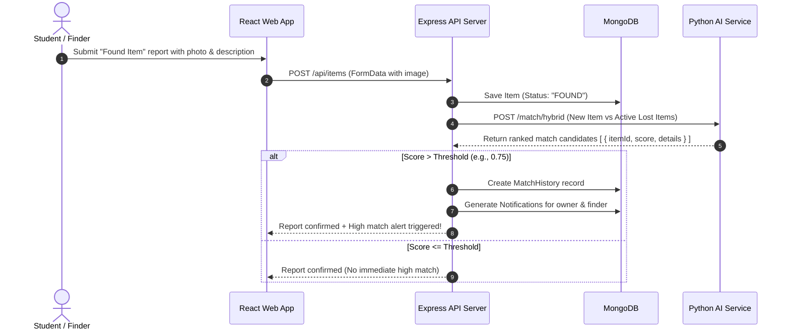

# Campus Lost and Found Architecture

## 1. System Overview

The Campus Lost and Found application connects students, faculty, and campus security through an automated item recovery pipeline.

```
       +-----------------------+
       |   React Web Client    |
       |  (Browser / Mobile)   |
       +-----------+-----------+
                   |
                   | HTTP / REST (Axios)
                   v
       +-----------+-----------+
       |  Express API Gateway  |
       |      (Node.js)        |
       +-----+-----------+-----+
             |           |
    Mongoose |           | HTTP (FastAPI Client)
             v           v
      +------+---+   +---+-------------------+
      | MongoDB  |   | Python AI Microservice|
      | Database |   |   (FastAPI / PyTorch) |
      +----------+   +-----------------------+
```

---

## 2. Core Components

### A. Frontend Client (`frontend/`)
- **Technology**: React 18, React Router v6, Axios, Lucide Icons.
- **Pages**:
  - `Home`: Feed of recently reported lost & found items with filter/search.
  - `ReportLost`: Multi-step form with image upload, timestamp, item tags, and campus location picker.
  - `ReportFound`: Form for finders with drop-off desk locator.
  - `History`: User's activity log and match request confirmations.
  - `Profile`: User contact details and notification settings.

### B. Backend REST API (`backend/`)
- **Technology**: Node.js, Express, MongoDB (Mongoose), JWT, Multer.
- **Responsibilities**:
  - User identity & role management (Student, Staff, Admin).
  - Item lifecycle management (`LOST`, `FOUND`, `MATCHED`, `RESOLVED`, `CLOSED`).
  - Image handling & dispatching to AI service.
  - Event notifications (Email & in-app).

### C. AI Matching Engine (`ai-module/`)
- **Technology**: FastAPI, NumPy, Scikit-learn (extensible to PyTorch / CLIP / SentenceTransformers).
- **Sub-modules**:
  - `feature_extraction.py`: Converts item photos into normalized vector representations.
  - `text_matcher.py`: Compares descriptions, titles, and categories via semantic cosine similarity.
  - `hybrid_match.py`: Combines visual and text signals into a single score:
    $$\text{FinalScore} = (w_{text} \times S_{text}) + (w_{image} \times S_{image})$$

---

## 3. Data Flow & Matching Cycle



---

## 4. API Endpoints Overview

| Method | Endpoint | Description |
|---|---|---|
| `POST` | `/api/auth/register` | Register user account |
| `POST` | `/api/auth/login` | Authenticate user & return JWT token |
| `GET` | `/api/items` | List items (filterable by type, status, category) |
| `POST` | `/api/items` | Report a new lost or found item |
| `GET` | `/api/items/:id` | Retrieve item details |
| `PATCH` | `/api/items/:id/status`| Update item status (e.g. `RESOLVED`) |
| `GET` | `/api/matches/:itemId` | Retrieve ranked match candidates for an item |
| `GET` | `/api/notifications` | Fetch user alerts |
| `PATCH` | `/api/notifications/:id/read` | Mark alert as read |
